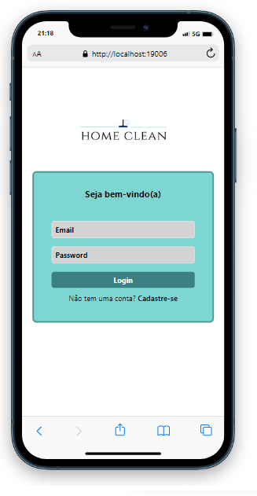
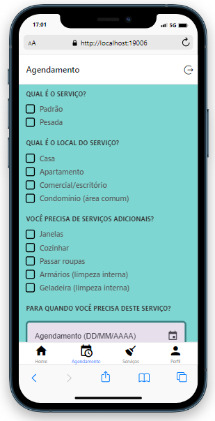
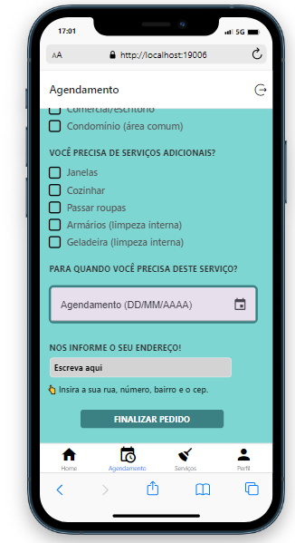

# Bem-Vindo ao aplicativo HomeClean 

Home Clean é um aplicativo voltado a serviços de limpeza!

 

## Tecnologias Utilizadas
 

 

Este aplicativo foi desenvolvido durante o segundo semestre do curso técnico de desenvolvimento de sistemas no SENAI-Florianópolis. Foi utilizado como estrutura base um aplicativo em react para pedidos em restaurantes e avaliação dos clientes.

## Imagens do aplicativo

 

 

 

 

 

 

 
